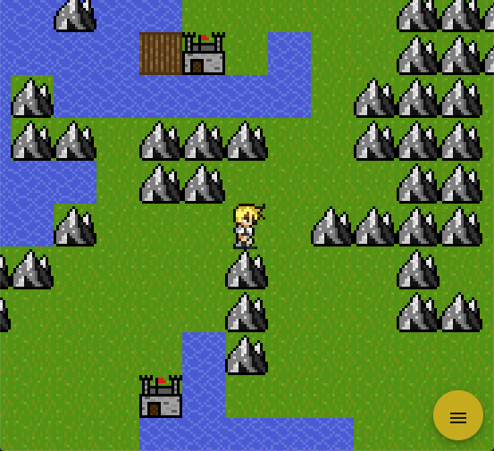
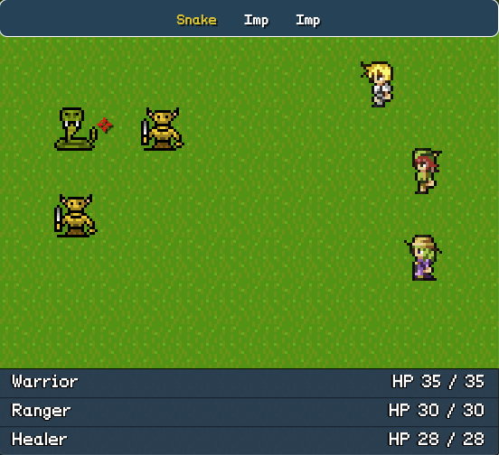
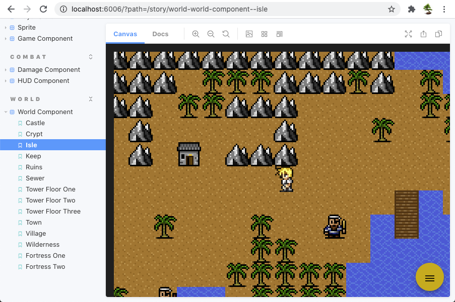

# AngularRPG

AngularRPG is a mobile-friendly 2D RPG starter inspired by games like Final Fantasy and Dragon Warrior.

## Development server 🖥

Run `ng serve` for a dev server. Navigate to `http://localhost:4200/`. The app will automatically reload if you change any of the source files.

## Storybook 💄

Run `npm run storybook` to run the local storybook UI development server. Navigate to `http://localhost:6006/`. The app will automatically reload if you change any of the source files.

## Build 🔨

Run `ng build` to build the project. The build artifacts will be stored in the `dist/` directory. Use the `--prod` flag for a production build.

## Running unit tests ✅

Run `ng test` to execute the unit tests via [Karma](https://karma-runner.github.io).

## Contributors ✨

Thanks goes to these people for their wonderful contributions ([emoji key](https://allcontributors.org/docs/en/emoji-key)):

<!-- ALL-CONTRIBUTORS-LIST:START - Do not remove or modify this section -->
<!-- prettier-ignore-start -->
<!-- markdownlint-disable -->
<table>
  <tr>
    <td align="center"><a href="https://mathy.ai"> <b>Justin DuJardin</b></a> <a href="https://github.com/justindujardin/angular-rpg/commits?author=justindujardin" title="Documentation">📖</a> <a href="https://github.com/justindujardin/angular-rpg/commits?author=justindujardin" title="Code">💻</a> <a href="#design-justindujardin" title="Design">🎨</a> <a href="#ideas-justindujardin" title="Ideas, Planning, & Feedback">🤔</a></td>
  </tr>
</table>

<!-- markdownlint-enable -->
<!-- prettier-ignore-end -->
<!-- ALL-CONTRIBUTORS-LIST:END -->

This project follows the [all-contributors](https://github.com/all-contributors/all-contributors) specification. Contributions of any kind welcome!
